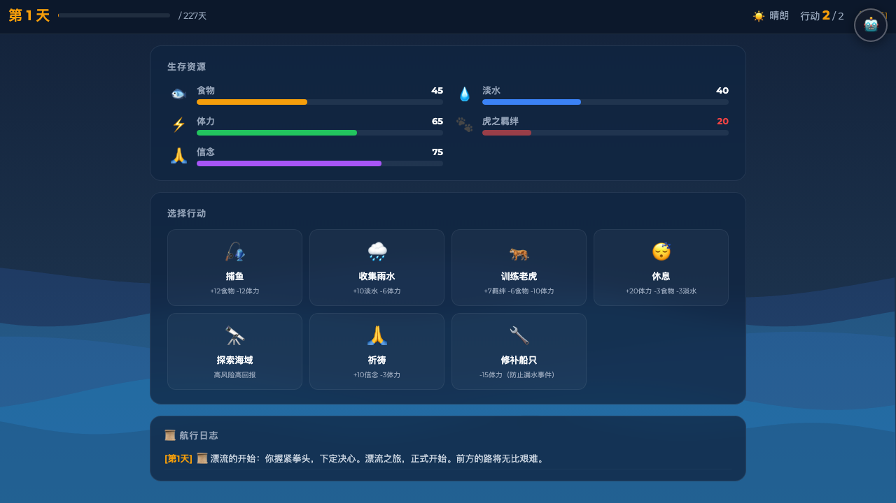
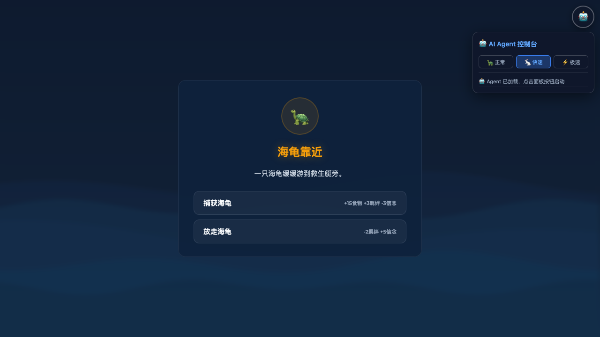
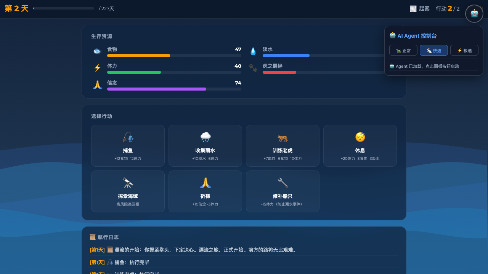

# 少年派的奇幻漂流 — 生存冒险游戏 🐅

一款基于《少年派的奇幻漂流》故事背景的网页生存冒险游戏。你将扮演少年派，在太平洋上与孟加拉虎理查德·帕克一起漂流 227 天，管理食物、淡水、体力、虎之羁绊和信念五项资源，做出关键抉择，最终到达墨西哥海岸。

## 游戏截图

### 🌊 开场序幕

故事从太平洋上的一场暴风雨开始，少年派独自面对未知的漂流之旅。


### 🎮 主游戏界面

管理五大生存资源（食物、淡水、体力、虎之羁绊、信念），每天执行 2 次行动——捕鱼、收集雨水、训练老虎、祈祷、探索海域、修补船只等。顶部显示当前天数、天气和剩余行动次数，底部航行日志记录每日事件。



### ⛈️ 随机事件与抉择

漂流途中会遭遇各种随机事件——海龟靠近、暴风雨、鲨鱼袭击、神秘岛屿等。每个选项带有不同的资源收益与代价，你的每一次选择都关乎生死。



### 🤖 AI Agent 自动通关

内置智能 AI Agent，可自动分析资源状态并选择最优行动策略，支持 3 档速度（正常 / 快速 / 极速），一键挂机自动通关 227 天！



## 游戏特色

- **资源管理**：食物、淡水、体力、虎之羁绊、信念五大资源，任一归零即失败
- **随机事件**：暴风雨、鲨鱼袭击、神秘岛屿等多种随机事件与抉择
- **Debuff 系统**：受伤、脱水、饥饿等负面状态持续影响资源消耗
- **天气系统**：不同天气影响资源变化和行动效果
- **难度递进**：随漂流天数增加，资源消耗加大、事件更加凶险
- **AI Agent**：内置智能策略引擎，支持自动游玩和一键通关
- **响应式设计**：支持桌面端和移动端（iOS / Android）自适应布局

## 项目结构

```
my-thinking/
├── index.html        # 游戏主页面
├── css/
│   └── style.css     # 样式和响应式布局
├── js/
│   ├── data.js       # 游戏数据常量、事件池、Debuff 定义
│   ├── events.js     # 事件管理系统
│   ├── ui.js         # UI 管理（Canvas 海浪动画、DOM 更新、场景切换）
│   ├── game.js       # 核心引擎（状态机、资源管理、每日循环、胜负判定）
│   └── agent.js      # AI Agent 自动通关策略引擎
├── screenshots/      # 游戏截图
├── start.sh          # 启动脚本
└── stop.sh           # 停止脚本
```

## 快速开始

### 本地运行

```bash
# 方式一：使用启动脚本
./start.sh            # 默认端口 8765
./start.sh 9000       # 自定义端口

# 方式二：手动启动
python3 -m http.server 8765
```

浏览器访问 `http://localhost:8765` 即可开始游戏。

### 停止服务

```bash
./stop.sh
```

## 技术栈

- **前端**：原生 HTML5 + CSS3 + JavaScript（无框架依赖）
- **动画**：Canvas 2D 海浪背景动画
- **部署**：支持 Docker (nginx:alpine) 部署

## License

MIT
